# Special Interest Group (SIG)
지역선도대학 육성사업의 일환으로 2016년 5월부터 9월까지 진행된 Special Interest Group(SIG) 프로젝트입니다. Front UI와 Server Side 코드 중 제가 구현한 부분만 있습니다.

# Summary
일반적으로 사용자들은 IoT 서비스를 위해 완제품기구를 사야 하며, 경우에 따라 매달 서비스 이용료를 지불해야 합니다. 하지만 개인이 원하는 서비스를 이용할 수 없는 경우가 많았기 때문에 IoT 서비스의 핵심 구성요소인 센서와 액추에이터를 손쉽게 사용하기 위한 도구의 개발 필요성이 강조되었습니다. 그래서 저희 연구실에서는 LED와 센서로 구성되어 각종 알림이나 정보를 사용자에게 알려 줄 수 있는 IoT Indicator를 제작하기로 결정하였습니다.<br>
<br>
이 프로젝트의 역할 분담은 다음과 같습니다.<br>
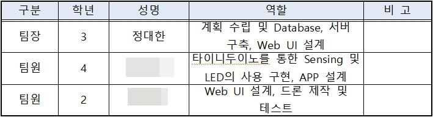
<br><br>IoT Indicator의 대략적인 특징과 기대효과는 다음과 같습니다<br>
```
- IoT Indicator는 아두이노 기반의 프로세서 보드를 장착한 임베디드 시스템으로써 직육면체의 반투명 기구이다.
  사용자는 버튼과 USB를 이용하여 인디케이터를 컨트롤 할 수 있다. USB로 내장 배터리를 충전하거나
  프로그램을 수정하는 데 사용된다
- Indicator는 사용자에게 편리하고 쉽게 서비스하기 위해 안드로이드 앱, server와 통신하며 사용자가 원하는 정보를 제공하고,
  초기 사용자는 앱을 통해 server에 접속하여 회원가입 및 장치관리를 진행한다. 또한 WiFi를 통해 자동으로 장치가
  server에 등록되어 사용자가 등록한 장치, 서비스정보를 출력해 줄 수 있다.<br>
- 단순히 분위기를 띄우기 위해 존재했던 등에 IoT를 접목시키게 되어 사람들이 스마트폰을 확인하기 힘든 환경에서도
  필요한 정보를 쉽게 얻을 수 있는 편리함을 제공할 수 있을 것이라 생각된다.<br>
```

# Detail
Indicator와 서버의 통신 프로토콜은 다음과 같습니다.<br>
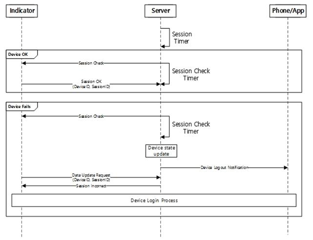
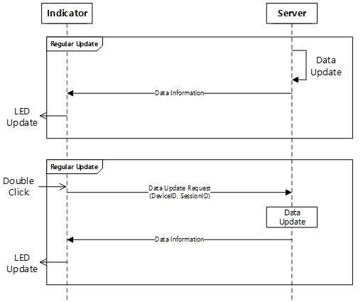
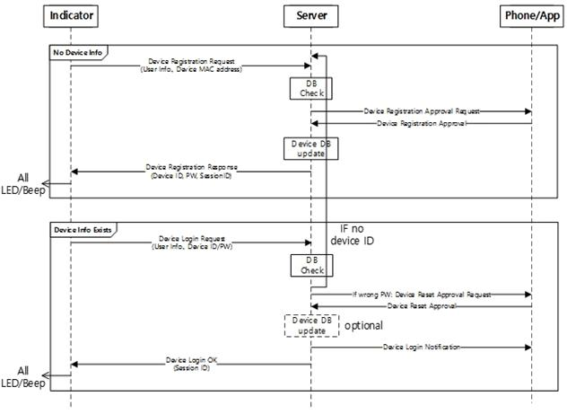
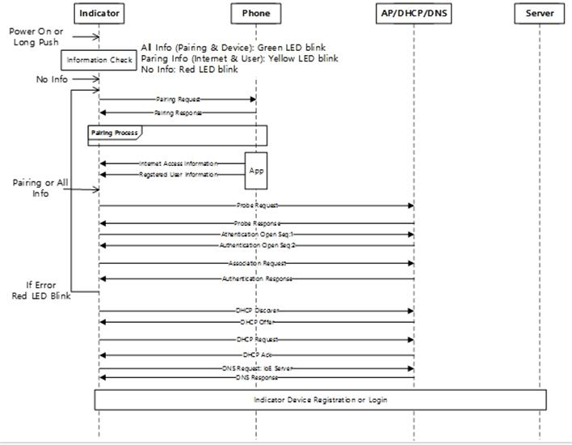
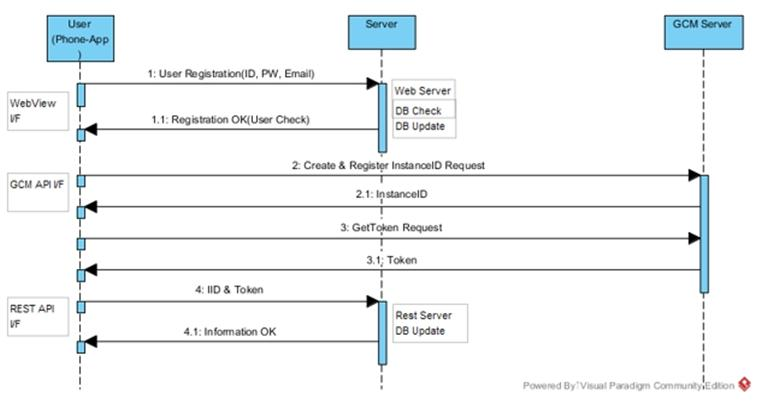

<br>서버의 UI는 다음과 같습니다<br>
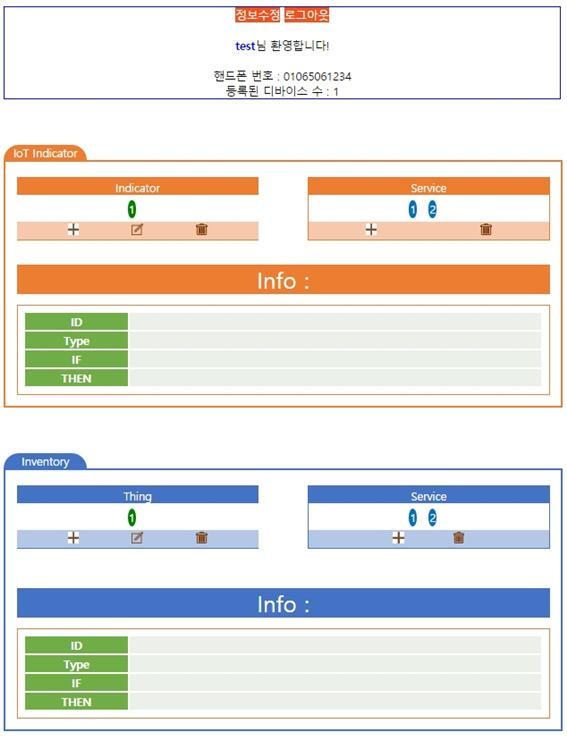
<br> 사용자가 등록한 Indicator와 이 Indicator에 등록된 서비스를 보여주는 Indicator 부분과 별도의 Thing, 그리고 전체 서비스를 보여주는 Inventory 부분으로 나뉩니다. 목록에 보이는 동그라미를 클릭하면 아래와 같은 정보가 출력됩니다<br>
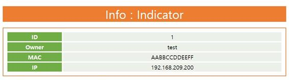
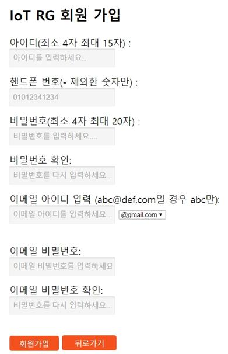
<br>사용자의 회원 가입 시 이메일 전송 및 수신 여부 확인을 위해선 이메일의 아이디와 비밀번호를 입력해야 하지만, 사용자의 요구를 반영하여 원하지 않는다면 이를 입력하지 않아도 됩니다.<br>
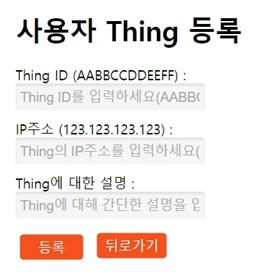
<br> 사용자의 디바이스나 Thing은 웹에서 직접 등록할 수도 있으며 Indicator인 경우는 와이파이를 통해 Server에 자동으로 등록할 수도 있습니다<br>
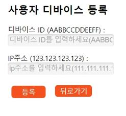
<br> 서비스의 경우 개인이 서비스를 제작할 수 있으며 각각의 Indicator마다 이 서비스를 모듈처럼 설치하는 방식으로 등록이 됩니다.<br>
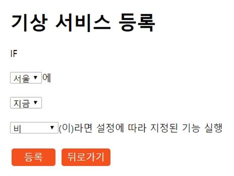
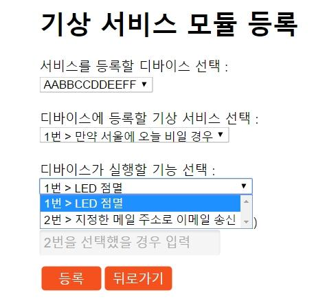
<br> 또한 Background Script가 동작하고 있어 서비스가 등록된 이후에는 Indicator의 세션이 도착할 때마다 서비스에 해당하는 기능을 확인한 후 알맞은 결과값을 보내줍니다(LED 점멸, 부저 출력 등)<br>
<br><br>
<br>Indicator의 완성 사진은 다음과 같습니다.<br>
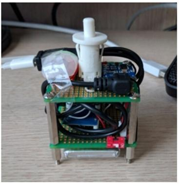
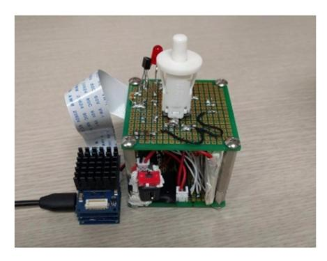


# More
이 아이템이 실제로 가치가 있을지 알아보기 위해 이 프로젝트와 다른 연구실에서 진행한 프로젝트를 같이 묶어 창업동아리의 아이템으로 신청해 선정되었습니다. 그리고 교내 '2016 창조혁신 아이디어 경진대회'에  참가해 대상을 수상했고, '제 4회 G-STAR 대학생 창업경진대회'에서 장려상을 수상했습니다. 그리고 한국정보과학회에서 주관한 '2016 동계학술대회'에 이 프로젝트에 대한 논문을 발표했습니다.
